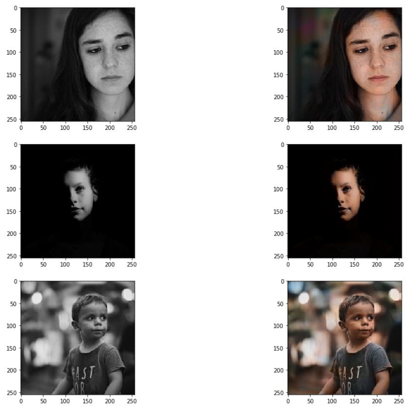
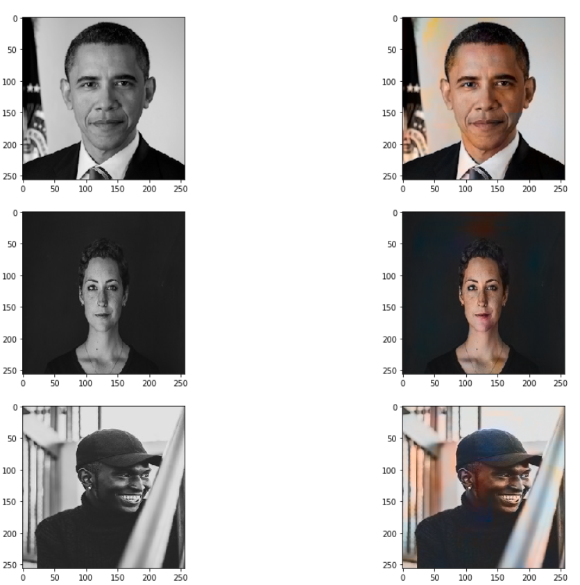
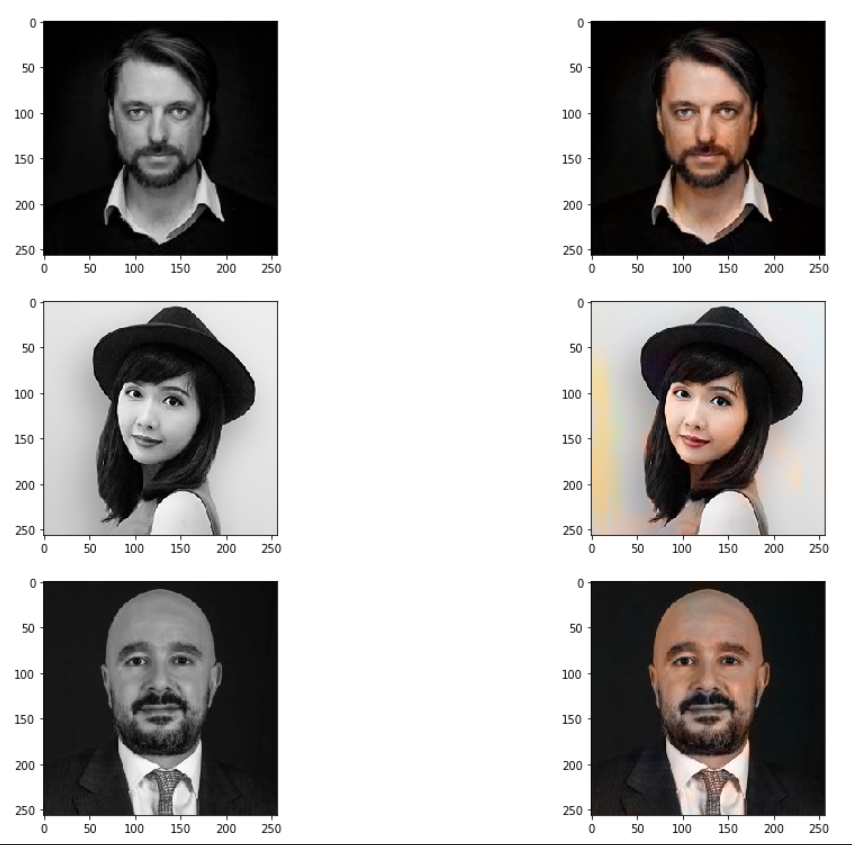
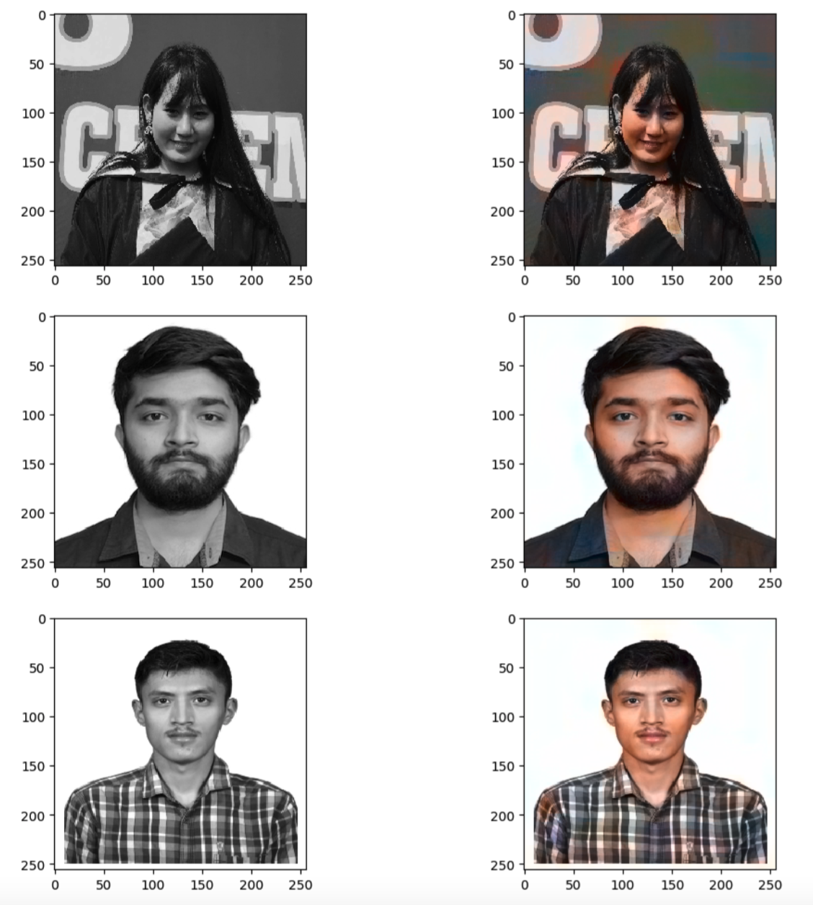

# Auto Colorization of Gray Scale Image using CNN.

## Tools Used
* Python 3
* Keras
* Numpy
* Tensorflow

## Dataset
* Dataset is included in the folder named Dataset.

## Team Member
* Rupesh Poudel
* Ravi Prajapati
* Nikita Subba

## Screenshot of Result
* Left Column includes the input images and the right column includes the automatically colorized images using CNN.

